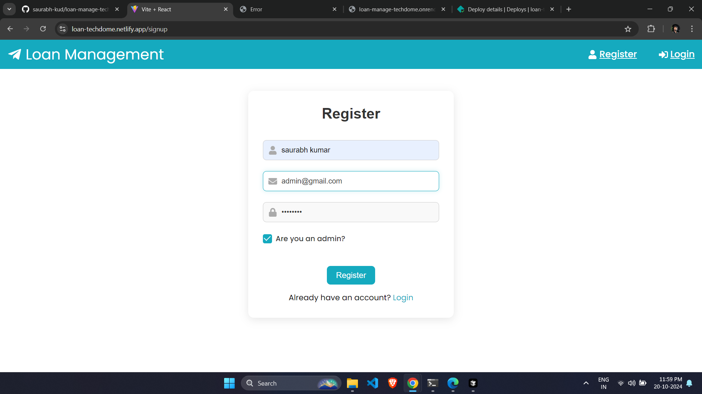
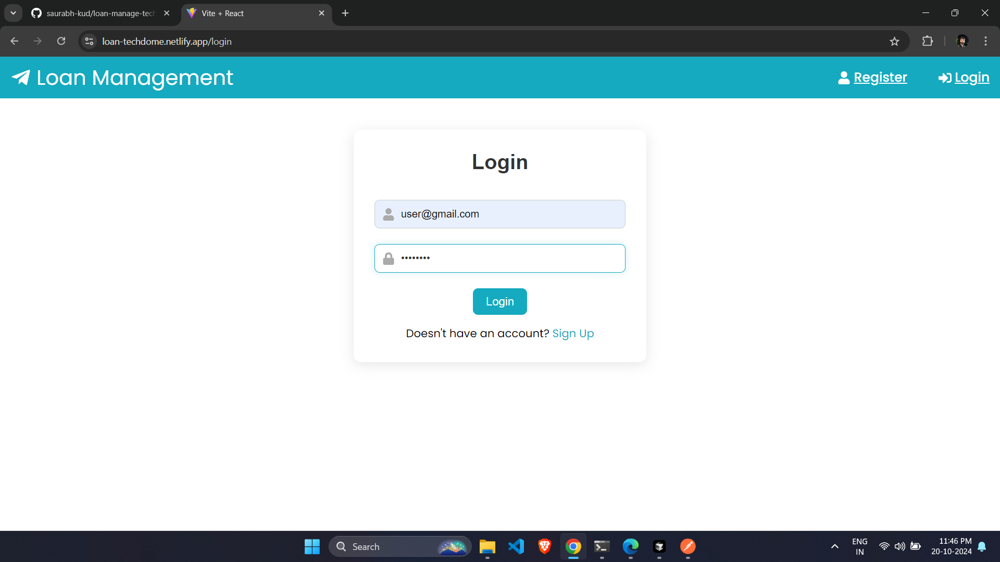
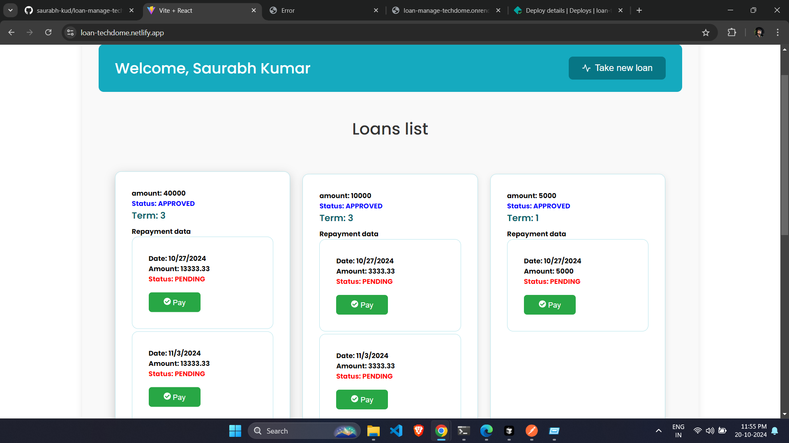
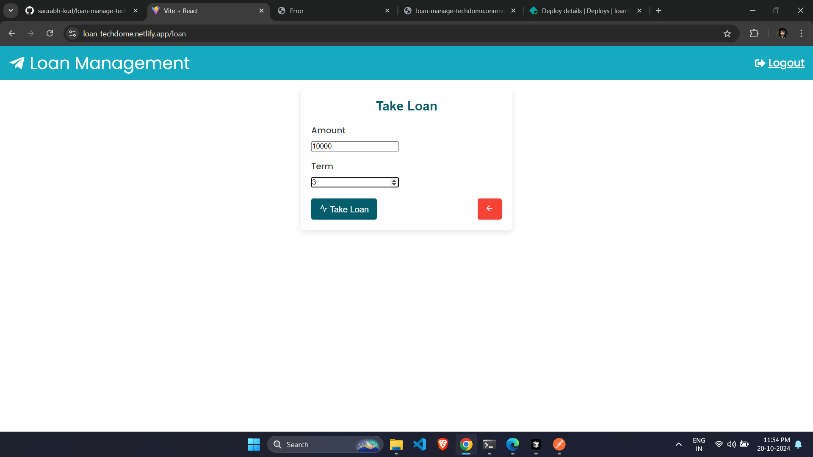
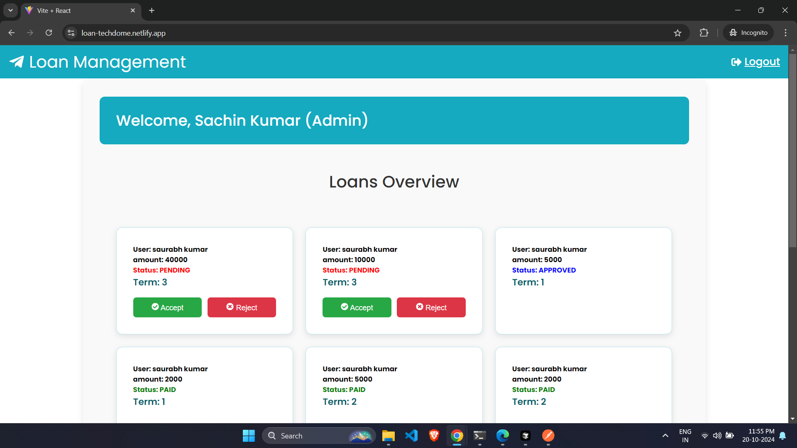

<h2 align='center'>Loan Management-Techdome</h2>
<p align="center">
<a href="https://github.com/saurabh-kud"></a>
</p>

<p align="center">
<a href="https://github.com/saurabh-kud"></a>
<a href="https://github.com/saurabh-kud/oan-manage-techdome/network/members"></a>
<a href="https://github.com/saurabh-kud/oan-manage-techdome/issues">
</a>

</p>

<p align="center">
    Loan Management- manage your loan
</p>

## api-postman-docs 🔗

[https://documenter.getpostman.com/view/38681155/2sAXxY2TJw](https://documenter.getpostman.com/view/38681155/2sAXxY2TJw)

## Api-Base-URL 🔗

[https://loan-manage-techdome.onrender.com](https://loan-manage-techdome.onrender.com)

> api might be show for first time because it is hosted on free service if we don't use that for sometime render shut-down service and it can take ~50sec to spin up

## Frontend live-link 🔗

[https://loan-techdome.netlify.app](https://loan-techdome.netlify.app)

## Frontend repo link 🔗

[https://github.com/saurabh-kud/loan-manage-frontend](https://github.com/saurabh-kud/https://github.com/saurabh-kud/loan-manage-frontend)

## creadential for testing purpous you can also create new account

```sh
 # admin user
 email : admin3@gmail.com
 password : admin@123

 # basic user
 email : user@gmail.com
 password : user@123

```

# task

Your task is to build a mini-loan APP:

It is an app that allows authenticated users to go through a loan application. It doesn’t have to
contain too many fields, but at least “amount required” and “loan term.” All the loans will be
assumed to have a “weekly” repayment frequency.

After the loan is approved, the user must be able to submit the weekly loan repayments. It can be a
simple repayment functionality, which won’t need to check if the dates are correct but will just set
the weekly amount to be repaid.

Actions to implement:

1. Customers can create a loan:

Customer submit a loan request defining amount and term
example:
Request amount of 10000 $ with term 3 on date 7th Feb 2022

• He will generate 3 scheduled repayments:

i. 14th Feb 2023 with amount 3.333,33 $

ii. 21st Feb 2023 with amount 3.333,33 $

iii. 28th Feb 2023 with amount 3.333,34 $

• The loan and scheduled repayments will have state PENDING.

2. Admins can approve the loan:

Admin change the PENDING loans to state APPROVED.

3. Customers can view loan belonging to him:

Add a policy check to make sure that the customers can view their own loan only.

4. Customers add repayments:

• Customers add a repayment with an amount greater or equal to the scheduled
repayment.

• The scheduled repayment will change the status of repayment to PAID.

• If all the scheduled repayments connected to a loan are PAID, the loan becomes PAID

# Bonus Added

- Added Basic Frontend to demonstrate the full working api

# tech stack used

Backend

- nodejs, express,jwt, bcrypt

Database

- mongodb

Fronted

- html, css, js, React

## Installation

```sh

# Clone the repo
$ git clone https://github.com/saurabh-kud/loan-manage-techdome

# go to loan-manage-techdome directory
$ cd loan-manage-techdome

# Install
$ npm install

# Setting Up ENV
> setup .env file for database and access token take refrence from .env.example file or below

# or can use this for as env change db url
DB_CONNECTION=db_url/loan?retryWrites=true&w=majority
PORT=8080
JWT_SECRET=test

# Start
$ npm start

# Access your app
$ http://localhost:${PORT}

```

## Screenshot

- Frontend
- register
<div align="center">
  
</div>
<br/>
- login
<div align="center">
  
</div>
<br/>
- user dashboard
<div align="center">
  
</div>
<br/>
- create loan
<div align="center">
  
</div>
<br/>
- admin dashboard
<div align="center">
  
</div>
<br/>

## Author

👤 **Saurabh kumar**

- Github: [@saurabh-kud](https://github.com/saurabh-kud)
- LinkedIN: [@saurabh-kud](https://www.linkedin.com/in/saurabh-kud/)

---

## License

&copy; Saurabh Kumar | MIT
